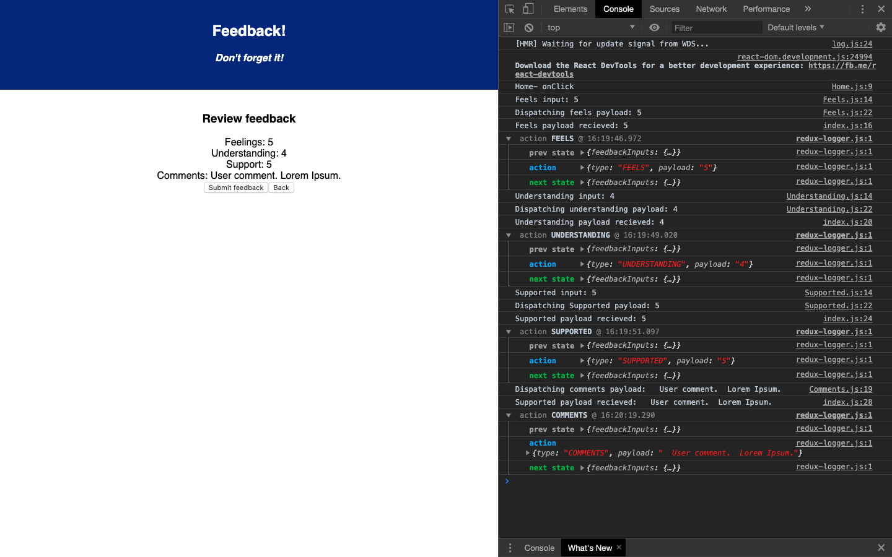

Description
Duration: 1 weekend

This is a feedback submission form that records inputs and comments and stores them in a redux store.  The inputs are reviewable and changeable prior to submission, at which time the feedback data is sent and stored in a database.

To see the fully functional site, please visit: TBA

Screen Shot

Prerequisites

Installation
$ npx create-react-app cra-orientation --scripts-version 2.1.8
$ npm install react-redux
$ npm install redux-logger (OPTIONAL)

There are no secret keys necessary to run this app.

Create a database named prime_feedback,
The queries in the tables.sql file are set up to create all the necessary tables and populate the needed data to allow the application to run correctly. The project is built on Postgres, so you will need to make sure to have that installed. We recommend using Postico to run those queries as that was used to create the queries,
Open up your editor of choice and run an npm install
Run npm run server in your terminal
Run npm run client in your terminal
The npm run client command will open up a new browser tab for you!

How to use this application:

Once all the above dependencies have been installed and the server and client have been started, the user can find the application on localhost:3000, from there the feedback form is a series of input fields that gathers the users feedback and submits it to a database.

This application 
Built With
Node.js
React
React Redux
PostgreSQL
Redux Logger

License
MIT

Note, include this only if you have a license file. GitHub will generate one for you if you want!

Acknowledgement
Thanks to Prime Digital Academy who equipped and helped me to make this application a reality. Big shout outs to Mary and Kris for the invaluable support throughout, as well as my cohortmates for their clutch help!

Support
If you have suggestions or issues, please email me at tcthinker@gmail.com